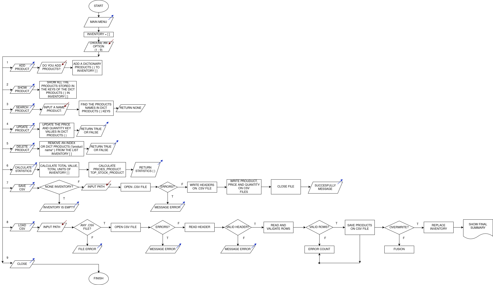

# Inventory Management System 

## Overview

This project implements a modular inventory management system using Python. It allows users to manage products, persist data using CSV files, and generate business statistics.

The system is built using core data structures (lists and dictionaries) and follows a modular architecture with separate service and file handling layers.

---

## User Story

Store and load inventory data using CSV files to preserve information between sessions, enable sharing, and analyze business statistics.

Apply lists, dictionaries, tuples, modules, and functions in Python to build a modular and persistent inventory system with CRUD operations, statistics, and file handling with validations and error management.

---

## Features

* Add products
* Show inventory
* Search products
* Update products
* Delete products
* Calculate statistics
* Save inventory to CSV
* Load inventory from CSV

---

## Data Structure

Inventory is stored as a list of dictionaries:

```python
{
    "name": str,
    "price": float,
    "quantity": int
}
```

---

## Project Structure

```
app.py          # Main application (menu and flow control)
services.py     # Business logic (CRUD + statistics)
files.py        # CSV read/write operations
inventory.csv   # Data storage file
```

---

## Diagram Flow



## Tasks Summary

### Task 1: Flow Diagram

* Complete system flow (CRUD + persistence)
* Includes save/load subflows
* Designed in draw.io (exported as PNG/PDF)

---

### Task 2: Modularization

Functions implemented:

* add_product
* show_inventory
* find_product
* update_product
* delete_product
* calculate_statistics

Each function includes docstrings and clear responsibilities.

---

### Task 3: Statistics

Calculated metrics:

* Total units
* Total inventory value
* Most expensive product
* Product with highest stock

---

### Task 4: Save CSV

* File format: `name,price,quantity`
* Validates non-empty inventory
* Handles write errors (permissions)
* Confirms successful save

---

### Task 5: Load CSV

* Validates header and row structure
* Converts data types (float/int)
* Skips invalid rows and counts errors
* Handles file errors (not found, encoding)
* Supports:

  * Replace inventory
  * Merge inventory (sum quantity, update price)

---

### Task 6: User Menu

Menu options:

1. Add Product
2. Show Products
3. Search Product
4. Update Product
5. Delete Product
6. Show Statistics
7. Save CSV
8. Load CSV
9. Exit

Includes:

* Input validation
* Error handling
* Continuous execution using `while`

---

## Execution

Run the program:

```bash
python3 app.py
```

---

## Notes

* The system prevents invalid data (negative values, wrong formats)
* Errors do not stop execution; the program always returns to the menu
* CSV persistence ensures data continuity between sessions

---
